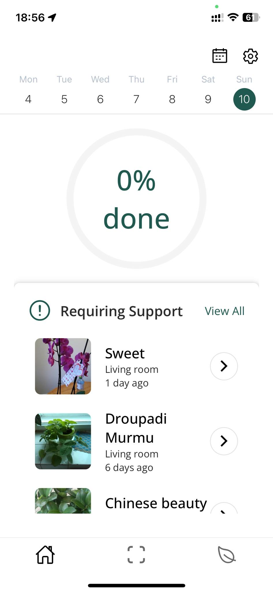
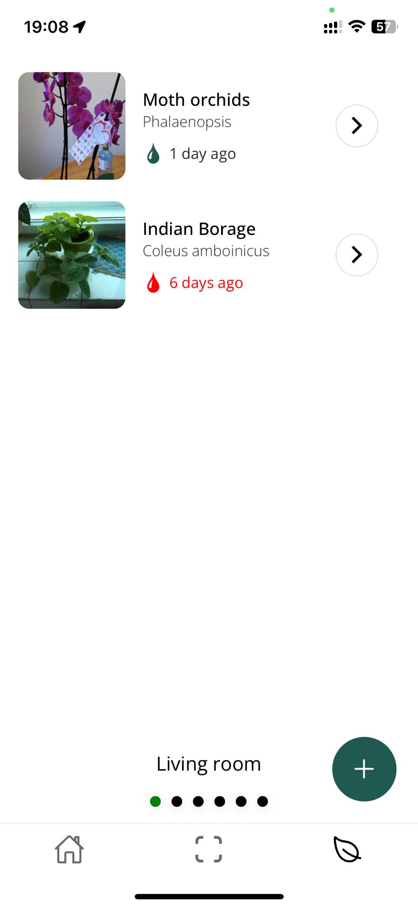
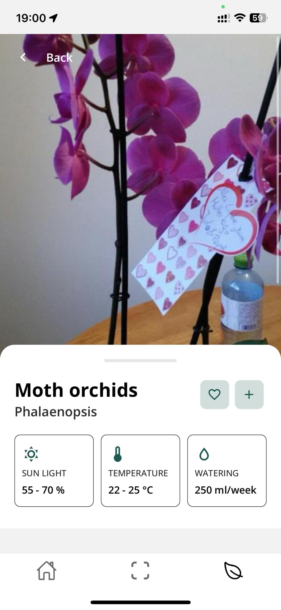

<p align="center">
  
</p>

<h2 align="center">Plantiful</h2>

<p align="center">
  A cross-platform mobile application designed to help users take care of their plants utilizing AI, image recognition APIs and algorithmization. Our features offer flower recognition through AI, watering reminders, and all the important information about the user's plants. We won Best Business Pitch and placed second in Best STEM Project at JA Expo, earning us a spot in the national finals. Completely open-source, written in React native.
  <br />
  <em>Built with Expo (React Native), React Navigation, Firebase, i18next, Plant.id API</em>
</p>


<p align="center">
  
  
  
</p>

<p align="center">
  <a href="#about">About</a> •
  <a href="#project-structure">Project Structure</a> •
  <a href="#setup">Setup</a> •
  <a href="#tech-stack">Tech Stack</a> •
  <a href="#camera--plant-identification">Camera</a> •
  <a href="#theming--fonts">Theming & Fonts</a> •
  <a href="#database-structure">Database</a> •
  <a href="#license">License</a>
</p>

## About

A cross-platform mobile application designed to help users take care of their plants utilizing AI, image recognition APIs and algorithmization. Our features offer flower recognition through AI, watering reminders, and all the important information about the user's plants. We won Best Business Pitch and placed second in Best STEM Project at [JA Expo](https://jaczech.org/ja-expo/), earning us a spot in the national finals.

## Project Structure

```
app/
├── app.json                 # Expo app config (name, icons, splash, plugins)
├── App.ts                   # RN AppRegistry entry that exports src/App
├── babel.config.js          # Babel preset (expo)
├── eas.json                 # EAS Build profiles
├── metro.config.js          # Metro bundler (SVG transformer)
├── package.json             # Dependencies and scripts
├── tsconfig.json            # TypeScript config
├── assets/
│   ├── fonts/               # OpenSans fonts used across the app
│   ├── images/              # App icons, splash, and screenshots
│   └── translations/        # i18n resources and init
├── src/
│   ├── App.tsx              # App root: fonts, auth gate, navigation containers
│   ├── firebase.ts          # Firebase init + typed RTDB helpers
│   ├── components/          # Reusable UI components (buttons, inputs, modals)
│   ├── screens/             # Screens (Auth, Settings, Scan, Plants, Details)
│   └── utils/               # Theme, types, fonts loader, LanguageContext
└── README.md                # This file
```

## Setup

```sh
./setup-<platform>.sh
```

Or just install [yarn](https://classic.yarnpkg.com/lang/en/docs/install) and [Node.js](https://nodejs.org)

In both cases run before start

```sh
yarn install
```

### Start

```sh
yarn start
```

### Install new package

```sh
yarn add <package-name>
```


### Tech Stack
- **Runtime**: React Native (Expo) `react-native@0.74`, `expo@51`
- **Language**: TypeScript
- **Navigation**: `@react-navigation/native`, stack + bottom-tabs
- **Auth & Data**: Firebase Auth + Realtime Database (RTDB)
- **State**: React Contexts (`LanguageContext`, `PlantContext`)
- **Internationalization**: `i18next` + `react-i18next` + `expo-localization`
- **Camera & Media**: `expo-camera`
- **UI**: Expo vector icons, custom components, OpenSans fonts

### State Management
- `LanguageContext` provides `language` and `setLanguage`. Used by i18n and API queries.
- `PlantContext` manages:
  - `rooms`: fetched from RTDB for the current user
  - `plants`: fetched for the active room
  - `currentRoomIndex`: controls current room in `PlantsScreen`
  - `addRoom(room)`, `addPlant(plant, roomId)` proxy to Firebase helpers and refresh local state

### Internationalization
- Initialization in `assets/translations/i18n.ts` using `expo-localization` to pick default language.
- Languages: `en`, `cs`, `al`, `sk` with flat keys (no keySeparator).
- Access via `i18n.t(key)` or `const { t } = useTranslation()`; current code imports and uses `i18n.t` directly.

### Firebase Integration
- Initialization: `initializeApp` + `initializeAuth` with `AsyncStorage` persistence.
- RTDB structure:
  - `users/{userId}/rooms/{roomId}` with `{ name }`
  - `users/{userId}/rooms/{roomId}/plants/{plantId}` with `PlantInfo`
  - `users/{userId}/wateringEvents/{wateringEventId}` for history
- Helpers in `src/firebase.ts`:
  - `addRoom(userId, roomName): Promise<string>` ensures uniqueness by name
  - `getRooms(userId)` -> array of `{ id, name }`
  - `addPlantt(userId, roomId, plantInfo)` -> create plant under room
  - `getPlantsInRoom(userId, roomId)` -> array of typed plants
  - `addWateringEvent(userId, event)` and `getWateringHistory(userId)`
  - `getCurrentUserId()` reads `auth.currentUser?.uid`


### Camera & Plant Identification
- Implemented in `src/screens/ScanScreen.tsx` using `expo-camera`.
- Flow:
  1. Request camera permission and mount `CameraView`.
  2. Capture image as base64 and show preview.
  3. Submit to Plant.id API (`/identification` or `/health_assessment` based on a toggle) with `language` from `LanguageContext`.
  4. On successful identification, build a `PlantInfo` and navigate to `PlantScanScreen` for user decision; if accepted, create a default room and save to RTDB.
- Implementation details:
  - Randomized `temperature` and `sunlight` placeholders until full data is provided by API.
  - Uses local activity indicator during network calls.

### Theming & Fonts
- `src/utils/colors.tsx` centralizes palette, sizes, and font family names.
- Fonts loaded via `src/utils/loadFonts.tsx` at app start (OpenSans family in assets).


## Database structure

```
{
  "users": {
    "userId": {
      "rooms": {
        "roomId": {
          "name": "string",
          "plants": {
            "plantId": {
              "photo": "string",
              "nickname": "string",
              "commonName": "string",
              "scientificName": "string",
              "taxonomy": {
                "class": "string",
                "genus": "string",
                "order": "string",
                "family": "string",
                "phylum": "string",
                "kingdom": "string"
              },
              "rank": "string",
              "description": "string",
              "watering": "number",
              "temperature": "string",
              "sunlight": "string",
              "lastWatered": "number"
            }
          }
        }
      }
   }
  }
}
```

## License

This project is open source and available under the [MIT License](LICENSE).